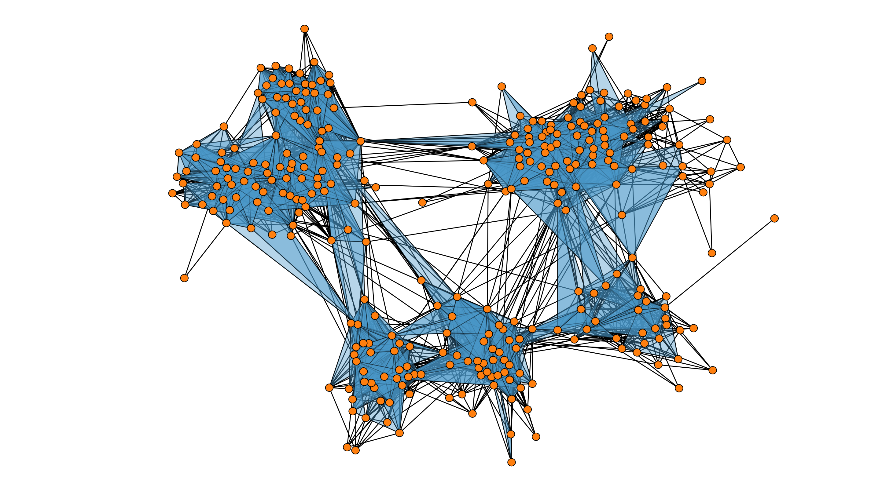

# py-draw-simplicial-complex
Draws a 2D simplicial complex from a list of simplices (as in [1]).

Dependencies
------------
* NetworkX 2.2
* Itertools

References
------------
[1] I. Iacopini, G. Petri, A. Barrat & V. Latora (2018) "Simplicial Models of Social Contagion". arXiv preprint arXiv:1810.07031.

